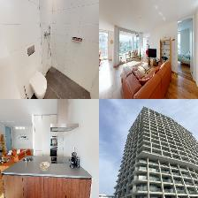
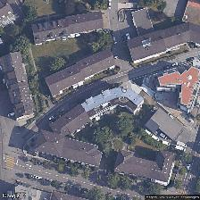
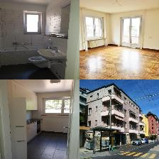
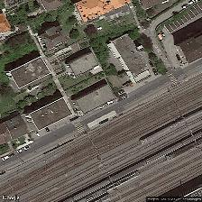
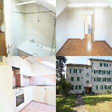
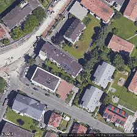
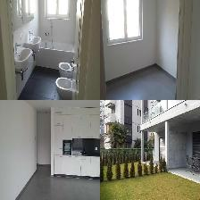
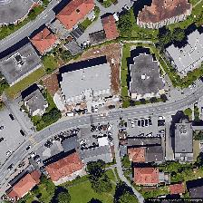

# SRED: Swiss Real Estate Dataset

[](https://doi.org/10.3390/bdcc6030096) [:page_with_curl:](https://www.mdpi.com/2504-2289/6/3/96):point_left:

[Ilia Azizi](https://iliaazizi.com), [Iegor Rudnytskyi](https://irudnyts.github.io/)

**Abstract:**
> Multi-modal data are widely available for online real estate listings. Announcements can contain various forms of data, including visual data and unstructured textual descriptions. Nonetheless, many traditional real estate pricing models rely solely on well-structured tabular features. This work investigates whether it is possible to improve the performance of the pricing model using additional unstructured data, namely images of the property and satellite images. We compare four models based on the type of input data they use: (1) tabular data only, (2) tabular data and property images, (3) tabular data and satellite images, and (4) tabular data and a combination of property and satellite images. In a supervised context, the branches of dedicated neural networks for each data type are fused (concatenated) to predict log rental prices. The novel dataset devised for the study (SRED) consists of 11,105 flat rentals advertised over the internet in Switzerland. The results reveal that using all three sources of data generally outperforms machine learning models built on only tabular information. The findings pave the way for further research on integrating other non-structured inputs, for instance, the textual descriptions of properties.

## Data

The Swiss Real Estate Dataset (SRED) is a multi-modal dataset of 11,105 flat rental listings scraped from a Swiss real estate platform (Immoscout24.ch) during February and March 2021.

The dataset can be downloaded [here](https://github.com/Unco3892/SRED_2022/releases/download/v1.0/SRED_data.zip). [![CC BY-NC-SA 4.0][cc-by-nc-sa-shield]][cc-by-nc-sa]

### Dataset Structure

```
SRED_data.zip
├── metadata/
│   ├── train_data.csv                 # Tabular features (9,996 listings)
│   ├── test_data.csv                  # Tabular features (1,109 listings)
│   ├── train_data_with_text.csv       # Tabular features + text (9,996 listings)
│   └── test_data_with_text.csv        # Tabular features + text (1,109 listings)
└── processed_images/
    ├── train/
    │   ├── montage_organized/         # 9,996 organized 2x2 montages (bathroom, living room, kitchen, exterior)
    │   ├── montage_random/            # 9,996 randomly arranged montages
    │   ├── satellite/                 # 9,996 Google satellite images (zoom level 19)
    │   └── cat/                       # 9,996 cat images (ablation control)
    └── test/
        ├── montage_organized/         # 1,109 organized montages
        ├── montage_random/            # 1,109 randomly arranged montages
        └── satellite/                 # 1,109 satellite images
```

Each row in the CSV files is uniquely identified by `listing_id`. Image filenames correspond to this identifier (e.g., `1154156.jpeg`).

### Tabular Features

| Variable | Description | Mean | Std | Min | Median | Max |
|---|---|---|---|---|---|---|
| `living_space` | Living area in m² | 86 | 31 | 19 | 83 | 1,502 |
| `rooms` | Number of rooms | 3.6 | 0.9 | 1.5 | 3.5 | 14 |
| `lat` | Latitude | 47.2 | 0.4 | 45.8 | 47.3 | 47.8 |
| `lon` | Longitude | 8.0 | 0.8 | 6.0 | 7.9 | 9.9 |
| `price` | Monthly rental price in CHF | 1,730 | 598 | 495 | 1,620 | 7,400 |

### Text Features (files with `_with_text` suffix)

| Variable | Description | Coverage |
|---|---|---|
| `header` | Listing title / announcement headline | 99.7% (11,069 / 11,105) |
| `ad_description` | Full text description of the property | 99.7% (11,067 / 11,105) |

Descriptions are primarily in German (~80%) and French (~20%), with a small number in Italian (~1.5%) and English (<1%), reflecting the Swiss linguistic regions. They were not translated and remain in the original language of publication.

### Image Types

- **`montage_organized`**: A 2x2 montage of four room types in fixed positions (top-left: bathroom, top-right: living room, bottom-left: kitchen, bottom-right: exterior). Property images were filtered through a three-stage classification pipeline to remove irrelevant images (logos, layouts, non-property photos) and classify room types.
- **`montage_random`**: Same four room-type images but randomly arranged. Used to evaluate whether consistent spatial arrangement of room types improves model performance.
- **`satellite`**: Google Static Maps satellite imagery centered on the listing coordinates at zoom level 19.
- **`cat`** (train only): Cat images from [Zhang et al. (2008)](https://link.springer.com/chapter/10.1007/978-3-540-88693-8_59) used as a negative control in the ablation study to validate that the model learns meaningful patterns from property images.

### Train/Test Split

The dataset is split 90/10 using stratified sampling on price:
- **Train**: 9,996 listings
- **Test**: 1,109 listings

There is no overlap between the train and test sets.

### Examples

Below are four sample listings, one per language, showing the data modalities available for each listing.

<table>
<tr>
<th>Listing</th>
<th>Description</th>
<th>Property montage</th>
<th>Satellite</th>
</tr>
<tr>
<td nowrap>
<strong>ID:</strong> 6371582<br>
<strong>Price:</strong> CHF 4,800<br>
<strong>Rooms:</strong> 3.5<br>
<strong>Space:</strong> 108 m²
</td>
<td><strong>Exclusive 3 1/2-room furnished town flat - The Metropolitans</strong><br><br><em>In the middle of a modern, urban environment, right next to Glattpark, "The Metropolitans" offer top-class living. The high-quality and tastefully furnished 3 1/2-room flat is located on the 14th floor...</em></td>
<td></td>
<td></td>
</tr>
<tr>
<td nowrap>
<strong>ID:</strong> 4623907<br>
<strong>Price:</strong> CHF 1,420<br>
<strong>Rooms:</strong> 3.0<br>
<strong>Space:</strong> 62 m²
</td>
<td><strong>LOCATION AVEC CAUTION GRATUITE</strong><br><br><em>Fenêtres rénovées. Cuisine entièrement agencée avec lave-vaisselle. Salle de bains/WC avec baignoire. Parquet dans toutes les chambres. Balcon. Proche de la gare et de toutes commodités...</em></td>
<td></td>
<td></td>
</tr>
<tr>
<td nowrap>
<strong>ID:</strong> 4154142<br>
<strong>Price:</strong> CHF 1,350<br>
<strong>Rooms:</strong> 2.5<br>
<strong>Space:</strong> 70 m²
</td>
<td><strong>helle schöne 2.5 Dachwohnung 3. OG ohne Lift</strong><br><br><em>Die Wohnung besticht durch die gute Raumaufteilung. Sie verfügt über eine moderne Küche mit GWM und Glaskeramik, und ein schönes helles Bad mit Fenster...</em></td>
<td></td>
<td></td>
</tr>
<tr>
<td nowrap>
<strong>ID:</strong> 5338725<br>
<strong>Price:</strong> CHF 2,100<br>
<strong>Rooms:</strong> 3.5<br>
<strong>Space:</strong> 115 m²
</td>
<td><strong>APPARTAMENTI 2,5 E 3,5 LOC. IN PRIMA LOCAZIONE</strong><br><br><em>A Lugano, via Sorengo 10, a due passi dalla stazione e cinque minuti a piedi dal centro città, affittiamo nuovi e spaziosi appartamenti di 2.5 e 3.5 locali, in elegante palazzina di 4 piani...</em></td>
<td></td>
<td></td>
</tr>
</table>

### Inclusion Criteria

Listings were included if they:
1. Reported an exact address (for geocoding)
2. Had a construction year before 2020
3. Had at least 4 property images
4. Had a living space of at least 18 m²
5. Had a rental price between CHF 200 and 7,500
6. Were located in Switzerland or cross-border cities (5 ≤ longitude ≤ 12, latitude ≥ 45)

## Code

For reproducibility, you can access the logs of the runs on TensorBoard and view the results as well as the model architecture (graphs). If you're interested in the code, you can open an issue, and we're happy to share it with you.
```
tensorboard --logdir logs
```

## License

This dataset is licensed under a
[Creative Commons Attribution-NonCommercial-ShareAlike 4.0 International License][cc-by-nc-sa].

**Note**: while we tried to identify images that are licensed under a Creative Commons Attribution license, we make no representations or warranties regarding the license status of each image and you should verify the license for each image yourself.

[![CC BY-NC-SA 4.0][cc-by-nc-sa-image]][cc-by-nc-sa]

[cc-by-nc-sa]: http://creativecommons.org/licenses/by-nc-sa/4.0/
[cc-by-nc-sa-image]: https://licensebuttons.net/l/by-nc-sa/4.0/88x31.png
[cc-by-nc-sa-shield]: https://img.shields.io/badge/License-CC%20BY--NC--SA%204.0-lightgrey.svg

## Citation

```bibtex
@article{bdcc6030096,
  author = {Azizi, Ilia and Rudnytskyi, Iegor},
  title = {Improving Real Estate Rental Estimations with Visual Data},
  journal = {Big Data and Cognitive Computing},
  volume = {6},
  year = {2022},
  number = {3},
  article-number = {96},
  url = {https://www.mdpi.com/2504-2289/6/3/96},
  issn = {2504-2289},
  doi = {10.3390/bdcc6030096}
}
```
